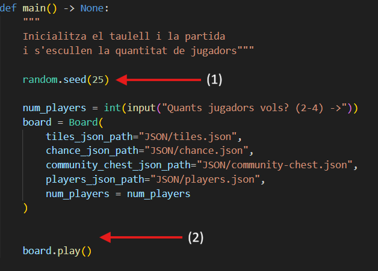

# PROJECTE MONOPOLY 2026 🎲
Aquest projecte tracta sobre la creació d'un monopoli totalment funcional (amb jugadors automàtics) i amb algunes diferències respecte al joc original. El joc es mostra en un html a part gràcies a la creació d'imatges .svg que representen cada acció i moviment fet durant la partida. Aquest README serveix per consultar qualsevol dubte que es tingui respecte al projecte.

# Índex
- **[Requeriments](#requeriments)**
- **[Preparació de la partida](#preparació-de-la-partida)**
- **[Com s'executa el joc](#com-sexecuta-el-joc)**
- **[Com visualitzar el joc](#com-visualitzar-el-joc)**
- **[Estructura del projecte](#estructura-del-projecte)**
- **[Decisions de disseny](#decisions-de-disseny)**
- **[Canvis respecte al joc original](#canvis-respecte-al-joc-original)**
- **[Testing](#testing)**

## Requeriments
Cal instal·lar la llibreria ``drawsvg``:

**CODI:** ``python3 -m pip install drawsvg``

I també *(necessari per executar els tests)*:

``pip install pytest pytest-cov``

## Preparació de la partida


Actualment les **constants** que hi ha són:
- *GO_SALARY*: 50$
- *START_MONEY*: 1000$

Com es pot veure a la imatge, el ``random.seed(25)`` és a la posició **(1)** *(en aquesta posició es genera sempre la mateixa partida)*. S'ha escollit aquesta *seed* perquè es pot veure **la majoria d'accions possibles (fins i tot algú es queda a 0$)** que es poden fer en el joc i així el *corrector/a* pugui veure el ***correcte funcionament*** del meu codi.

Si es desitja generar partides aleatories cada vegada que s'executa el main, s'ha de col·locar el ``random.seed(25)`` a la posició **(2)**. I si directament es vol que sempre s'executi la mateixa partida, però que sigui diferent a la que hi ha assignada, doncs s'ha de canviar el nombre ``25`` per un altre.

⚠️ *Vigilar* que si es canvia aquest paràmetre, depenent de la partida **potser no té final.**

## Com s'executa el joc
1. Situa't a la carpeta ``PROJECTE_MONOPOLY``
2. Executa el ``main.py`` (Clicant a ▶️ o escrivint a la terminal ``python CODIS/main.py``)
3. Introdueix el nombre de jugadors *(2-4)* quan t'ho demani la terminal.

El joc crearà les imatges a la carpeta ``images`` dins de ``CODIS`` 
## Com visualitzar el joc
1. Situa't dins ``PROJECTE_MONOPOLY\CODIS`` des de la terminal
2. Executa a la terminal (Windows): ``python3 slideshow.py partida.html``

Si utilizes MAC, prova el següent codi: ``python3 slideshow.py partida.html images/i*.svg`` (tot i que l'altre també et funcionaria)

3. Obre el fitxer ``partida.html`` per veure la partida

## Estructura del projecte
<pre>
PROJECTE_MONOPOLY/
├── CODIS/
│   ├── main.py          # Executor del joc
│   ├── board.py         # Taulell i lògica principal del joc
│   ├── tile.py          # Caselles del taulell
│   ├── player.py        # Jugadors
│   ├── card.py          # Targetes de Chance i Community Chest
│   ├── deck.py          # Baralles de targetes
│   ├── strategies.py    # Estratègies dels jugadors automàtics
│   ├── draw.py          # Generació d'imatges SVG
│   ├── slideshow.py     # Visualitzador HTML de la partida
│   ├── const.py         # Constants del joc
│   └── images/          # Imatges SVG generades
└── JSON/
    ├── tiles.json           # Dades de les caselles
    ├── players.json         # Dades dels jugadors
    ├── chance.json          # Targetes de Chance
    └── community-chest.json # Targetes de Community Chest
</pre>

## Decisions de disseny
### ```tile.py```
Com indica l'objectiu del projecte, s'ha utilitzat **l'herència** i el **polimorfisme** amb una "classe pare" anomenada Tile. L'estructura de les caselles és la següent:
<pre>
Tile (base)
├── Property
│   ├── Street
│   ├── Station
│   └── Utility
├── chance
├── community_chest
├── tax
└── special
</pre>
A ``Property`` hi ha un ``land_on`` que és el que s'usarà en general en tots els tipus de propietats. Però, gràcies al **POLIMORFISME**, cada tipus té un ``rent_calculation`` amb el seu propi càlcul de lloguer. El que s'aconsegueix amb això, és que des del ``land_on`` es crida ``self.rent_calculation()`` per calcular el lloguer del tipus de propietat que hagi caigut el jugador.

***PER QUÈ S'HA IMPLEMENTAT UN MULTIPLIER EN EL ``land_on``?***

Per defecte és 1 perquè no afecti el càlcul del lloguer, però el multiplier s'utilitza per quan un jugador cau en una **estació o utility** per culpa d'una targeta *chance o community chest*, ja que la targeta imposa un multiplicador del lloguer.

***PER QUÈ ``Utility`` TÉ UN ``land_on`` PARTICULAR?***

Perquè la targeta indica que el multiplicador ha de ser **x10** independentment de quantes utilities tingui. És diferent que les estacions on només s'ha de multiplicar el resultat final.

### ``player.py``
Emmagatzema tot el seu estat: *posició al taulell, diners, propietats comprades, targetes de sortida de presó i si està a la presó o en fallida*. Les decisions de joc *(comprar, construir, hipotecar...)* es fan o no depenent de l'estratègia assignada mitjançant els mètodes ``wants_to_*()``, que simplement consulten l'estratègia i retornen un booleà. El moviment es gestiona amb ``move()``, que avança el jugador i cobra **GO_SALARY** automàticament si passa per la sortida. La presó i la fallida tenen els seus propis mètodes (``go_to_prison(), leave_prison(), go_bankrupt()``) que van actualitzant l'estat del jugador

### ``strategies.py``
Els jugadors automàtics faran una acció o un altre gràcies a la classe ``Strategy``. Cada estratègia conté un ``desire_of...`` que retorna un booleà indicant si es vol fer aquella acció o no.

**TIPUS D'ESTRATÈGIES:**

- ``Simple_Strategy``: Sempre compra i mai construeix res
- ``Smart_Strategy``: Compra mantenint un coixí (``MINIMUM_MONEY``), hipoteca si baixa del mínim i deshipoteca quan té prous diners(``UNMORTGAGE_MONEY``)

**DETALL IMPORTANT☝🏻:**
Hi ha mètodes en el ``tile.py`` que diuen ``can_...``, aquests retornen un booleà segons les *normes del joc* i el ``desire_of_...`` segons *l'estratègia*

### ``board.py``
**SISTEMA DE DAUS**

S'ha creat un mètode auxiliar pels daus anomenat ``dice`` que retorna el nombre de l'última tirada i el ``current_dice`` tira els daus (genera nombres) i retorna el resultat.

El ***motiu*** és perquè en el ``draw.py``, per dibuixar els valors dels daus agafava ``current_dice`` i com aquesta funció genera nous nombres cada vegada que es crida, doncs no coincidirien el nombres de caselles que el jugador es mou i els nombres que surten en els daus.

**FRAMES EXTRES**

Es generen frames extres en els següents casos:

- **Utility amb propietari:** Es mostra una altra tirada pel càlcul del lloguer
- **Chance/Community Chest:** Es mostra l'execució de la carta a més a més de quan el jugador hi cau
- **Go To Jail:** Mostra que el jugador cau a la casella i en el següent frame és a *la presó*

**GESTIÓ DE FALLIDA**

Quan un jugador queda amb ***diners negatius (tenint 0$ segueixes viu)*** després d'un ``land_on``:

- Totes les *propietats* tornen **al banc** *(per fomentar que durant la partida, l'estratègia tingui un paper important i hagi de decidir si comprar les caselles que ara estan buides o no)*
- Les *targetes per sortir de la presó* tornen a **baix del piló** d'allà on s'han agafat inicialment
- El jugador es *marca* com ``is_bankrupt = True`` i els diners es posen a 0$
- *Les peces* dels jugadors es queden **allà on ha mort**, perquè així, quan acabem la partida, sabem en quina casella ha mort cadascú.
- El *jugador* es queda **visible** tota la partida *(El seu quadrat on es mostren totes les seves estadístiques)*

**TARGETES DE SORTIDA DE PRESÓ**

S'ha creat un mètode ``set_deck()`` per assignar d'on ve la targeta i poder-la tornar a deixar en el piló que toca després del seu *ús o declaració de fallida.*

**CONSTRUCCIÓ UNIFORME**

S'ha tingut en compte en tot moment la **construcció uniforme:** no es pot construir una casa en un carrer si les altres tenen menys.

Es gestiona en el ``can_build`` del ``Street``, que recorre tots els carrers del mateix color i comprova si aquell carrer té menys cases que els altres carrers (en el cas contrari no deixaria construir).

També, relacionat amb la **construcció uniforme**, en el ``board.py``, dins de ``post_movement_actions()`` es fan múltiples passades amb el ``while action_done`` per garantir que es construeixi tantes vegades com sigui possible, sempre respectant *la construcció uniforme.*

**CANVI EN LES CONSTANTS**

S'han modificat les constants a ``const.py`` perquè les partides siguin més **dinàmiques** i durin menys frames. Per tant, perquè els jugadors amb una *estratègia simple* **NO comprin** tant i permetin els jugadors automàtics *més llestos* aconseguir monopolis, s'han implementat aquests canvis:

- **Go Salary:** 200$ -> 50$
- **Start Money:** 1500$ -> 1000$

### ``def play()``
Aquest mètode, situat en el ``board.py``, és el que fa funcionar tot el joc, ja que gestiona el **bucle** sencer de la partida i s'encarrega de **generar les imatges** per visualitzar la partida.

**GESTIÓ DE LA PARTIDA**

S'ha posat un *límit* en el bucle perquè la partida acabi quan queda **una persona viva** o bé, quan s'han generat ja **2000 frames** i encara no ha acabat. S'ha fet per *evitar* un bucle molt llarg o fins i tot infinit.

**GESTIÓ DE TORNS**

Llança els daus automàticament (``current_dice``), comprova si hi ha dobles per permetre tirs extra i avança l'índex per passar al següent jugador, sempre ignorant els que estan en fallida.

**LÒGICA DE LA PRESÓ**

Gestiona totes les accions possibles que es poden fer mentres algú és a la **presó** i revisa si en aquell torn es compleix algun requisit per sortir-hi. *(Tirar dobles, utilitzar una carta de "Get Out of Jail" o si arriba al límit de 3 torns a la presó, sent el mateix tercer torn quan pot sortir)*

**MOVIMENTS I ACCIONS**

Mou els jugadors pel taulell i crida a la funció ``execute_tile`` per realitzar les accions de la casella. Si es sobreviu, es crida al mètode ``post_movement_actions`` que s'encarrega de gestionar les *compres i vendes de cases/hotels, hipoteques, deshipotecar...* I un cap finalitzat això, s'acaba el torn.

## Canvis respecte al joc original
Per simplificar el procés de creació del projecte, s'han fet alguns canvis respecte les normes oficials dels jocs:

- **NO** es poden *subhastar* les propietats
- S'han modificat els *diners inicials* 
- S'han modificat els *diners* que reben quan passen pel **GO**
- **NO** es pot sortir de la presó pagant *50$* ni s'ha de pagar quan es surt amb el tercer torn
- Quan es cau en *fallida*, **totes les propietats** van al *banc* i poden tornar a ser comprades per altres jugadors quan hi cauen
- **NO** es poden fer *tractes ni intercanvis entre jugadors*

## Testing 
***COVERAGE ACONSEGUIT:*** *93,16%🔋* 

(No s'ha comptat el ``board.py``, ja que s'hi *dibuixen les imatges* i no es vol que es creïn noves imatges mentres es fan testos i per tant, com no ha estat testejat tan exhaustivament, no té un percentatge tan alt.)

Els tests es troben dins de la carpeta ``/CODIS`` amb els noms ``test_board``, ``test_card``, ``test_player``, ``test_strategies``, ``test_tile``.

Per executar-ho segueix els següents passos:

1. Situar-se a ``PROJECTE_MONOPOLY/CODIS`` 
2. A la banda esquerra, s'haurà de clicar en una icona semblant a un **matràs d'erlenmeyer**. 
3. Situar-se sobre "PROJECTE_MONOPOLY" i en teoria hi ha de veure tres ▶️, doncs cliqui el tercer que posa *"Run test with coverage"*. 

Fent això es mostren el % de línies comprovades amb els testos

**EINES UTILITZADES**

- ``pytest``: Marc de treball per fer proves
- ``@pytest.fixture``: Permet crear objectes de prova reutilitzables (board, player, ...) i s'inicialitzen automàticament a cada test
- ``os.path``: Per indicar la ruta dels JSON 
- ``cast()``: Utilitzat en alguns testos. Declara que una variable és d'un cert tipus, per exemple, s'ha fet que ``test_board = cast(Board, None)`` perquè així no es tinguin problemes amb el *pylance* i no s'hagi de crear un board sencer per provar coses que *no* necessita el board.

| Fitxer | Què es testeja?
|---|---
| ``test_card.py`` | Totes les subclasses de ``Card``: **moviment** *(posició, estació, utility, endarrere)*, **presó** *(anar i poder sortir)*, **diners** *(cobrar i pagar)* i targetes que afecten a **múltiples jugadors**
| ``test_tile.py`` | Els diferents tipus de **caselles**: *compra i disponibilitat, lloguers, construccions i ventes uniformes, tax, Go To Jail, Chance i Community Chest*
| ``test_player.py`` | *Inicialitzador del jugador, moviment i pas pel GO, gestió de propietats, targetes de presó, torns a la presó i fallida*
| ``test_strategies.py`` | Les dues estratègies(``Simple_strategy`` i ``Smart_strategy``) en tres situacions diferents: *ric, regular i pobre*
| ``test_board.py`` | *Inicialitzador del taulell, getters bàsics, tirada de daus i gestió de la fallida*
